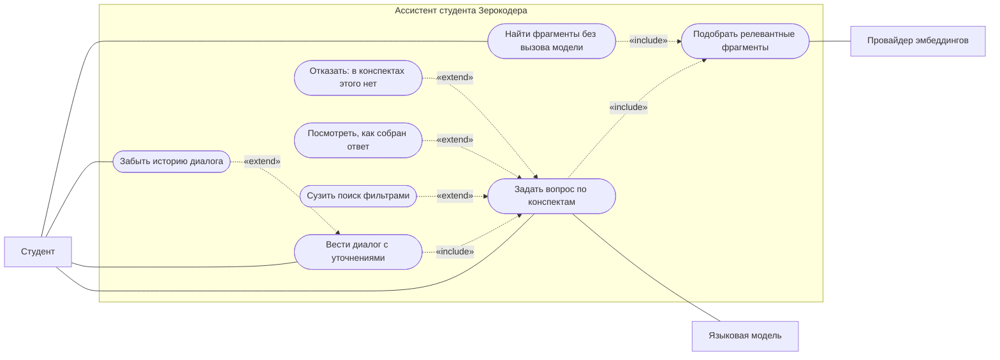
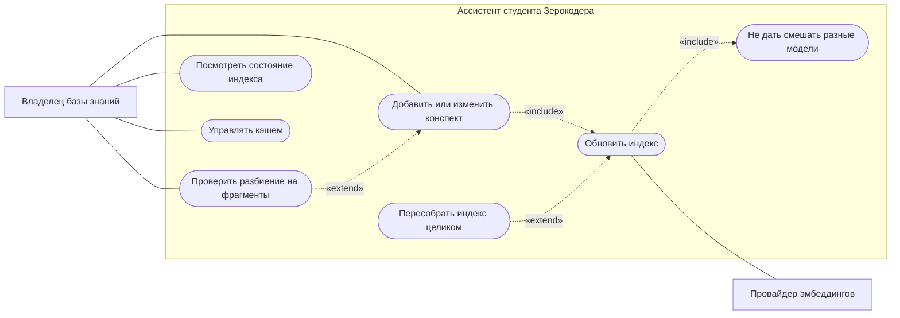
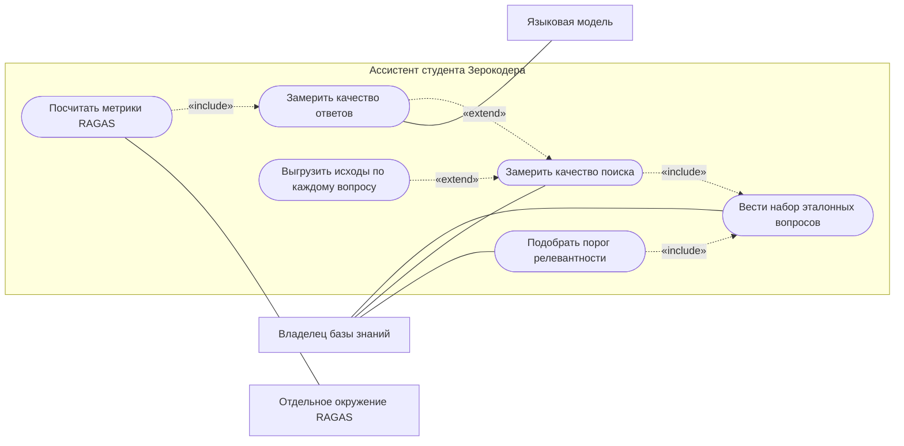

# Ассистент студента Зерокодера

Терминальный RAG-ассистент, который отвечает на вопросы **строго по вашим
конспектам** и честно говорит «в конспектах этого нет» вместо того чтобы
выдумать правдоподобный ответ.

Задача, которую он решает: конспектов набирается несколько десятков файлов, и
через месяц вы помните, что «где-то это было», но не помните где. Обычный
поиск по словам не помогает — вы не помните формулировку. Ассистент ищет по
смыслу, отвечает своими словами и показывает, из какого урока взято каждое
утверждение.

Итоговый проект модуля 5 курса промпт-инжиниринга «Ассистенты с памятью: базы
знаний, RAG и Relevance».

## Как это выглядит

Вопрос, ответ на который в конспектах есть:

```
$ zassist ask "что такое порог релевантности"

Порог релевантности (Score Threshold) — это настройка, которая определяет,
насколько высоким должно быть совпадение вектора запроса с вектором в базе,
чтобы чанк был извлечён и использован [3].

Источники:
  1. PEr06 > Результат дня
  2. PEr06 > 6. Практический пример: тестирование RAG-системы с RAGAS (часть 5/8)
  3. PEr08 > 4. Параметры RAG (часть 2/2)
```

Вопрос на смежную тему, которой в конспектах нет:

```
$ zassist ask "Как поднять Redis, чтобы кэш переживал перезапуск сервера?"

В конспектах этого нет. Рядом лежит информация о кэшировании и его
особенностях [1], [2], [3], а также о работе RAG-ассистента с кэшем [4].
```

Второй случай — главный. Система, которая на такой вопрос уверенно расскажет
про Redis, бесполезна: проверять придётся каждый ответ, а тогда проще читать
конспекты самому.

## Что нужно для запуска

| | |
|---|---|
| **Python** | 3.11 или новее (проверено на 3.14) |
| **Ключ API** | OpenAI либо [ProxyAPI](https://proxyapi.ru) — второй работает из России |
| **Конспекты** | ваши собственные файлы `.md` (в репозитории их нет) |

Индексация всего корпуса из 46 конспектов стоит около одного цента —
`text-embedding-3-small` дешёвая. Основные расходы приходятся на ответы.

## Быстрый старт

**1. Установить**

```bash
python -m venv .venv
```

Windows:

```bash
.venv\Scripts\activate
```

macOS/Linux:

```bash
source .venv/bin/activate
```

```bash
pip install -e ".[dev]"
```

**2. Настроить**

```bash
cp .env.example .env
```

В `.env` заполнить два поля:

```
OPENAI_API_KEY=sk-...
NOTES_DIR=C:/путь/к/вашим/конспектам
```

Папка с конспектами может лежать где угодно, в том числе вне проекта.
Если пользуетесь ProxyAPI — вместо ключа OpenAI задайте `PROXYAPI_API_KEY` и
поставьте `LLM_PROVIDER=proxyapi`, `EMBED_PROVIDER=proxyapi`.

**3. Посмотреть, как разобьются конспекты — бесплатно, без обращения к API**

```bash
zassist index preview
```

Команда покажет сводку, гистограмму размеров чанков и несколько примеров.
Здесь стоит убедиться, что чанки осмысленные, а служебные разделы отброшены.

**4. Собрать индекс**

```bash
zassist index build
```

Векторизуется только изменившееся, поэтому повторный запуск почти бесплатен.
Посмотреть план, ничего не потратив: `zassist index build --dry-run`.

**5. Спросить**

```bash
zassist ask "как работает кэширование в RAG"
```

Что делать дальше — в [руководстве пользователя](docs/user_guide.md): как
формулировать вопросы, читать ссылки на источники, вести диалог с уточнениями,
добавлять новые конспекты и мерить качество.

## Формат конспектов

Ассистент ждёт папку с файлами `.md`, разложенными по модулям:

```
<NOTES_DIR>/
├─ Модуль 1. Основы промптинга/
│  ├─ PEb01_Что_такое_нейросети.md
│  └─ PEb02_Базовые_принципы.md
└─ Модуль 5. Ассистенты с памятью/
   ├─ PEr06_Оценка_качества_RAG.md
   └─ PEr08_Практика_ассистент.md
```

Метаданные выводятся автоматически, ничего размечать не обязательно:

- **идентификатор урока** — из начала имени файла (`PEr08_...` → `PEr08`);
- **модуль и его номер** — из имени папки (`Модуль 5. ...` → `5`);
- **название урока** — из первого заголовка `#` в файле.

Если автоматики не хватает, любое поле переопределяется YAML-frontmatter:

```yaml
---
lesson_id: PEr08
module: "Модуль 5. Ассистенты с памятью"
module_num: 5
title: "Практика: ассистент по документации"
notes_version: 1
---
```

При индексации выбрасываются повторяющиеся из файла в файл служебные разделы
(шапки, «Домашнее задание», пересказ предыдущего урока) — список настраивается
в `config/constants.py`. Разделы «Результат дня» и «Актуализация» сохраняются:
первый — лучший ответ на вопрос «о чём был урок», второй содержит самые свежие
поправки.

## Возможности

Диаграммы вариантов использования: что система умеет и кто этим пользуется.
Пунктиром показаны отношения UML — `«include»` (шаг всегда входит в сценарий)
и `«extend»` (необязательное расширение). Подробное руководство пользователя —
[docs/user_guide.md](docs/user_guide.md).

### Работа с ассистентом



Отказ «в конспектах этого нет» — полноценный вариант использования, а не
ошибка: когда после отсечения по порогу не остаётся ни одного фрагмента,
языковая модель не вызывается вовсе.

### Сопровождение базы знаний



Проверка индекса на совместимость встроена в сборку: имя модели эмбеддингов
входит в имя коллекции и записано в манифесте, поэтому смешать в одном индексе
две модели не получится.

### Оценка качества



Замер поиска модель не вызывает и потому почти бесплатен — его можно гонять
хоть на каждое изменение. Всё, что стоит денег, включается отдельным ключом.

## Команды

| Команда | Что делает |
|---|---|
| `zassist index preview` | Как разобьются конспекты. Не тратит API |
| `zassist index build` | Собрать индекс; векторизуется только изменившееся |
| `zassist index stats` | Что лежит в индексе и чем он собран |
| `zassist search "запрос"` | Найти фрагменты. **Не** вызывает языковую модель |
| `zassist ask "вопрос"` | Ответить по конспектам |
| `zassist ask --repl` | Диалог с памятью: `/clear` — забыть, `/exit` — выйти |
| `zassist eval run` | Метрики поиска по golden set. Не вызывает модель |
| `zassist eval threshold` | Подобрать порог релевантности |
| `zassist index preview --dump-clean` | Выложить очищенные конспекты, чтобы посмотреть глазами |
| `zassist eval ragas` | Метрики RAGAS (нужна отдельная установка) |
| `zassist cache stats` | Состояние кэша |

Полезные ключи:

```bash
zassist ask "что такое overlap" --verbose
```

показывает отбор фрагментов, размер контекста и тайминги по этапам.

```bash
zassist search "оценка качества" --lesson PEr06
```

ограничивает поиск одним уроком; так же работают `--module` и `--content-type`.

```bash
zassist ask "вопрос" --no-cache
```

обходит кэш. Все команды и опции — `zassist --help`.

## Настройка

Всё, что стоит крутить, задаётся через `.env`; полный список с пояснениями —
в [.env.example](.env.example). Предметные константы — какие секции конспекта
служебные, что считать шумом, по каким словам узнаётся уточняющий вопрос —
живут в `config/constants.py`: это описание корпуса, а не настройка, и менять
его надо вместе с тестами. Самое ходовое из `.env`:

| Переменная | По умолчанию | Смысл |
|---|---|---|
| `TOP_K` | 5 | Сколько фрагментов уходит в контекст |
| `RELEVANCE_THRESHOLD` | 0.30 | Ниже этого сходства фрагмент не берётся |
| `CLEAN_DIR` | `./storage/clean` | Куда `--dump-clean` кладёт очищенные конспекты |
| `OVERFETCH_FACTOR` | 3 | Во сколько раз больше кандидатов запросить до отсечения |
| `CHUNK_TARGET_TOKENS` | 400 | Целевой размер чанка |
| `CHUNK_OVERLAP_PCT` | 15 | Перекрытие соседних чанков |
| `MAX_CONTEXT_TOKENS` | 3000 | Бюджет контекста |
| `HISTORY_PAIRS` | 5 | Сколько пар реплик помнит диалог; 0 — память выключена |
| `ANSWER_PROMPT_FILE` | `rag_answer_v2.md` | Какую редакцию промпта использовать |

Смена `TOP_K`, порога или модели корректно **промахивается мимо кэша**:
параметры входят в его ключ, а не лежат рядом. Правка промпта тоже — версией
промпта служит хеш его содержимого.

## Как это устроено

Четыре независимых конвейера, связанных файлами на диске, а не общими объектами
в памяти. Поэтому поменять размер чанка можно, не трогая конспекты, а оценку
гонять, не поднимая ассистента.

| | Конвейер | Что делает | Состояние |
|---|---|---|---|
| **P1** | Авторство | Страница урока или файл (PDF/HTML/DOCX) → конспект `.md` | спроектирован, не реализован |
| **P2** | Индексация | Конспекты → очищенные чанки → векторное хранилище | работает |
| **P3** | Запрос | Вопрос → эмбеддинг → поиск → отбор контекста → LLM → ответ | работает |
| **P4** | Оценка | Golden set → метрики качества поиска и ответов | работает |

Конспекты сегодня пишутся вручную, и команды `notes` в CLI нет. Разделение при
этом не умозрительное: именно оно позволяет менять параметры чанкинга, не
трогая сами конспекты. Замысел P1 — в [docs/architecture.md](docs/architecture.md),
раздел «P1. Авторство конспекта».

Конвейер запроса подробнее:

```
вопрос -> кэш ответа -> эмбеддинг -> поиск (top_k x overfetch)
       -> порог релевантности -> дедупликация -> срез top_k
       -> сборка контекста -> LLM -> ответ + источники
```

Порядок здесь важен. Если сначала взять `top_k`, а потом отсечь по порогу,
порог будет сокращать контекст вместо того чтобы его улучшать. И если после
отсечения не осталось ничего — это готовый ответ «в конспектах нет», модель не
вызывается вовсе.

Кэш трёхуровневый (вектор запроса, результаты поиска, готовый ответ) и живёт в
одном файле SQLite.

Обоснование решений целиком — в [docs/architecture.md](docs/architecture.md).

## Качество

Измеряется на golden set из 51 вопроса
([docs/golden_set.yaml](docs/golden_set.yaml)): 40 с известным правильным
уроком и 11 таких, ответа на которые в конспектах нет.

```
recall@1 60% | recall@3 75% | recall@5 88% | MRR 0.697
отказы там, где ответа нет: порогом 3 из 3, моделью 8 из 8
придуманных ответов: 0 | ссылок на несуществующие фрагменты: 0
ложных отказов: 6 из 40 — порогом 0, моделью 6
латентность p50/p95: 13 / 17 мс без модели, 2598 / 4448 мс с моделью
```

**Ложные отказы — не регресс, а то, что раньше не измерялось.** Метрика считала
ложным отказом только пустую выдачу поиска, поэтому отвечала «0» даже когда
модель отказывалась на вопросе, по которому нужный урок был найден. Сейчас в
шести случаях из сорока ассистент говорит «в конспектах этого нет», хотя
фрагменты у него есть, — и это самая заметная точка роста системы.

Число здесь плавает: соседние прогоны дают 6 и 7, и набор вопросов тоже
меняется. Причина не в метрике, а в `TEMPERATURE=0.2` — ответы не
детерминированы, и решение отказаться принимается заново каждый раз. Числа
поиска (recall, MRR, зазор) от прогона к прогону не меняются вовсе: там
случайности нет.

Метрики RAGAS на 40 отвечаемых вопросах: `faithfulness` 0.892,
`context_precision` 0.834.

Два вывода из измерений, которые стоит знать до того, как менять настройки:

**Порог релевантности не защищает от смежных тем.** Вопросы вроде «как поднять
Redis для кэша» дают сходство до 0.588 — выше, чем минимум у вопросов, ответ на
которые есть (0.325). Классы перекрываются, и никакой порог их не разделит.
Отказ на смежной теме — работа промпта, а не порога, поэтому порог выбран по
recall.

**`answer_relevancy` из RAGAS здесь меряет не то, что нужно.** Метрика ставит
ноль ответам, которые честно оговаривают, чего в конспектах не нашлось: из 19
нулевых такую оговорку содержат 17, из 21 ненулевого — один. Складывать её в
общий балл значило бы поощрять удаление этих оговорок, то есть ухудшать
систему ради числа.

Подробный разбор обоих — в [инженерном журнале](docs/engineering_log.md).

## Оценка через RAGAS

RAGAS ставится в **отдельное** окружение — но на том же Python, что и всё
остальное. Второй версии интерпретатора не нужно: `ragas 0.4.3` работает на
CPython 3.14, как и ядро.

Разделение нужно из-за конфликта пакетов, а не версий языка. RAGAS требует
`langchain-openai`, который объявляет `openai<3.0.0`, тогда как ядро работает
на `openai` 3.x:

```
langchain-openai 0.3.35 требует: openai<3.0.0,>=1.104.2
```

Установка в общее окружение молча откатит клиент, которым делается каждый
запрос к модели и каждый запрос эмбеддингов. Обойти это нельзя: связка
`ragas==0.4.3` + `openai>=3` не разрешается вовсе (`ResolutionImpossible`).

Обратный вариант — удержать ядро на `openai` 2.x — отвергнут сознательно:
необязательный инструмент оценки не должен диктовать версию клиента, на
котором работает сам продукт.

```bash
python -m venv .venv-eval
```

Windows:

```bash
.venv-eval\Scripts\python.exe -m pip install -r requirements-eval.txt
```

macOS/Linux:

```bash
.venv-eval/bin/python -m pip install -r requirements-eval.txt
```

Затем в `.env` — путь к интерпретатору этого окружения:

```
RAGAS_PYTHON=./.venv-eval/Scripts/python.exe
```

```bash
zassist eval ragas --limit 5
```

Если не настраивать, команда не сломается — скажет, чего не хватает, и
завершится успехом.

Версии зафиксированы жёстко, и не из перестраховки: ветка 0.1.x на 3.14 не
ставится, а 0.2.x ставится и импортируется, но **не считает ничего** — патчит
asyncio через `nest_asyncio` и молча выдаёт `NaN` вместо метрик. Разбор всех
веток — в [requirements-eval.txt](requirements-eval.txt), подробности с
воспроизведением — в [инженерном журнале](docs/engineering_log.md).

## Разработка

```bash
pytest
```

```bash
ruff check src tests && ruff format --check src tests
```

479 тестов. Интеграционные идут по реальному корпусу и автоматически
пропускаются, если `NOTES_DIR` недоступен, поэтому набор проходит и на чистой
машине без конспектов.

## Структура

```
src/zerocoder_assistant/
├─ config/          настройки из окружения и предметные константы
├─ preprocessing/   разбор Markdown, очистка, чанкинг, метаданные
├─ embeddings/      поставщики эмбеддингов (OpenAI, ProxyAPI)
├─ llm/             клиенты языковых моделей
├─ vectorstore/     ChromaDB и манифест индекса
├─ indexing/        сборка индекса с идемпотентной переиндексацией
├─ retrieval/       поиск: порог, дедупликация, фильтры
├─ generation/      промпт, сборка контекста, ответ
├─ memory/          короткая память диалога
├─ cache/           кэш на SQLite в три уровня
├─ evaluation/      golden set, метрики, подбор порога, мост к RAGAS
├─ observability/   секундомер этапов и учёт попаданий в кэш
├─ reporting.py     агрегаты и текстовые отчёты
├─ errors.py        предсказуемые отказы, отличимые от сбоев
└─ cli/             команды терминала

prompts/                    системные промпты (версия = хеш содержимого)
docs/user_guide.md          руководство пользователя
docs/architecture.md        архитектурное решение целиком
docs/engineering_log.md     как проект складывался и что показали измерения
docs/golden_set.yaml        51 вопрос для оценки качества
tests/                      модульные тесты и прогон по реальному корпусу
```

В корне проекта только конфигурация и документация.

## Известные ограничения

Всё это измерено, а не предполагается, и лежит здесь, чтобы не выяснять это
самостоятельно:

- **Модель отказывается на 6-7 отвечаемых вопросах из 40.** Поиск нужный урок
  нашёл, а ответа студент не получил. Самая заметная точка роста; лечится
  промптом, а не параметрами поиска.
- **Порог не отделяет смежные темы.** Классы перекрываются, зазор −0.263.
  Отказ на теме, которая рядом с корпусом, но которой в нём нет, — работа
  ветки C системного промпта, и никакое значение `RELEVANCE_THRESHOLD` её не
  заменит.
- **Дедупликация на этом корпусе не срабатывает ни разу.** Максимум сходства
  между фрагментами одной выдачи — 0.200 при пороге 0.8. Это страховка от
  дословных повторов, которых в конспектах пока нет, а не работающий этап.
- **Отказ опознаётся по формулировке, а не по смыслу.** Метрика ловит слова
  («в конспектах», «не указано»), поэтому даёт оценку снизу. Судить моделью
  было бы точнее, но тогда качество мерилось бы той же моделью, которую
  оценивают.
- **`answer_relevancy` из RAGAS штрафует честные оговорки** — ровно то
  поведение, ради которого они и сделаны. Подробности в
  [инженерном журнале](docs/engineering_log.md).
- **Конвейер авторства (P1) не реализован.** Конспекты пишутся вручную.

## Что сознательно не сделано

Каждый пункт — осознанный отказ, а не пропуск:

- **отдельная модель-реранкер** — тяжёлые зависимости ради корпуса в тысячу
  чанков;
- **гибридный поиск BM25 + вектор** — усложнение, выигрыш от которого на этом
  корпусе не измерен;
- **расширение запросов через LLM** — лишний вызов модели на каждый вопрос;
  вместо него уточняющие вопросы дополняются по списку слов;
- **веб-интерфейс и Telegram** — проект терминальный по требованию;
- **облачные хранилища векторов** — Chroma локально закрывает объём с запасом;
- **долгосрочная память между запусками** — история живёт в пределах сессии.

Это же список возможных направлений развития.
